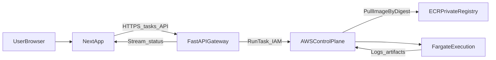

# Fortress: Data Flows and Per-Hop Classification

**Status:** Draft (Phase 0)  
**Companion:** [trust-boundaries.md](./trust-boundaries.md)

## 1. End-to-end diagram

## 2. Hop-by-hop: protocol, authentication, and data

| Hop | Protocol | Authentication | Data crossing (examples) | Classification |
|-----|----------|------------------|---------------------------|----------------|
| User → Next.js | HTTPS | Browser session / OIDC to app | Task text, UI state | User content; PII if logged—minimize |
| Next.js → Gateway | HTTPS | Bearer token or session cookie issued by gateway/IdP | Task create, stream subscription | User content; no ECR credentials |
| Gateway → AWS control | HTTPS TLS 1.2+ | IAM principal (access key via instance role, or role assumption) | `RunTask`, `DescribeTasks`, `GetTaskProtection` (if used), log queries | Control metadata; task IDs; no raw user secrets in AWS API names |
| AWS → ECR (on behalf of Fargate) | AWS-managed | Fargate **task execution role** | Image layers for **pinned digest** | Supply-chain artifact; integrity from Cosign policy elsewhere |
| Fargate → CloudWatch (typical) | AWS APIs / agent | Task role / execution role per AWS docs | stdout/stderr, structured logs | May contain generated code snippets—treat as sensitive |
| Gateway → Next.js (stream) | HTTPS (SSE or WebSocket) | Same session as API | Status events, final output, provenance handles | Mix of user-visible + attestation metadata |

## 3. Data classes (handling rules)

| Class | Description | Where it may appear | Rules |
|-------|-------------|---------------------|--------|
| **UserContent** | Prompts, attachments metadata | Next.js, Gateway, logs | Encrypt in transit; retention policy TBD; avoid logging full payloads by default |
| **GeneratedCode** | Agent-produced source | Execution logs, artifact store | Treat as untrusted code until reviewed; do not auto-execute on Brain |
| **Provenance** | SBOM URI, digest, signature verdict | Gateway DB/cache, API to client | Immutable pointers to build artifacts |
| **CloudCredentials** | IAM, KMS, Cosign | Gateway host only (never browser, never user code in Fargate for v1) | Short-lived; least privilege; rotation per secrets matrix |

## 4. Boundaries explicitly excluded in v1

- **Direct Gateway → Fargate socket:** No ad-hoc TCP from gateway into the task; interaction is mediated by AWS task lifecycle and any future pre-signed artifact URLs if introduced deliberately in a later ADR.
- **Registry credentials inside execution image:** Execution must not contain ECR push credentials or Cosign **signing** keys.

## 5. References

- [trust-boundaries.md](./trust-boundaries.md)  
- [secrets-identity.md](./secrets-identity.md)  
- [../security/container-supply-chain.md](../security/container-supply-chain.md)  
